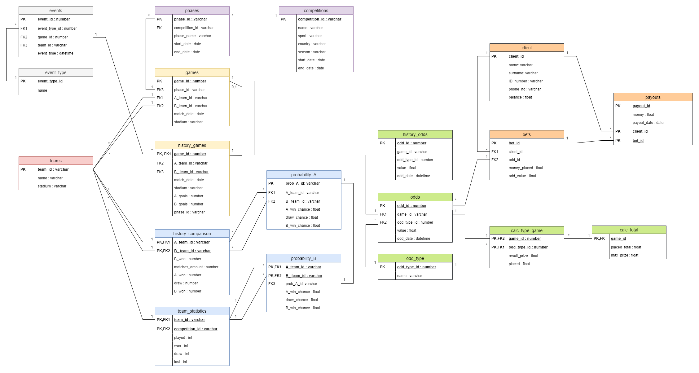
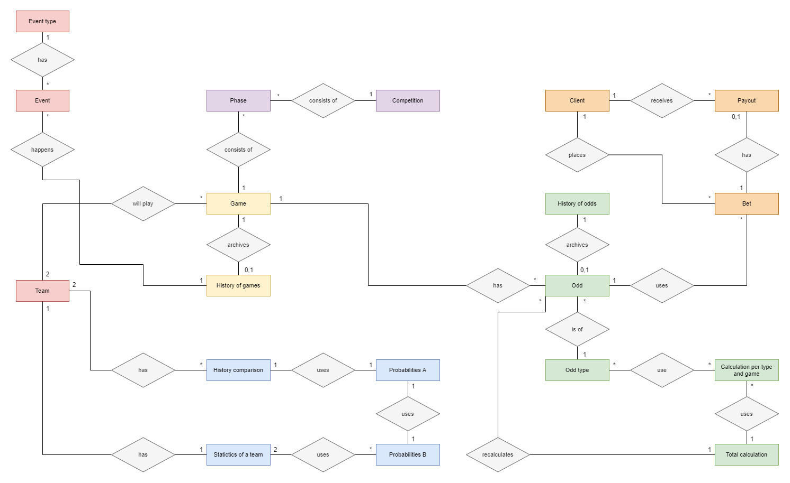

# Bet-Stakeholders

Project realized on ISEC - Instituto Superior de Engenharia de Coimbra on 6th semester as a paticipant of Database and Architecture and Management. Project was made on Oracle 11g database with the PL/SQL usage. In repository there are provided all essential scripts for schema creation, population and instatiation of all necessary prodecures, triggers and functions. In the description belowe there are some formulas nad schema representation how database system is constructed.

Database is imitation of database for stakeholders company which collects bets on matches planned of Portuguese Liga NOS football competition. All formulas for calculation has been provided by subject supervisor.

Authors: Antoni Forzpańczyk and Jędrzej Szor

## Schema structure
Database model:

  

Entity relationship diagram:

  

# Getting started

## 1. database setup:
To ensure consistency of database workflow we suggest Oracle 11g database
<link>

## 2. schema creation:
To create all structure of the database you need to execute files stored in /schema folder.
<nazwy plików>

## 3. population:
To populate database with initial records there is necessity to execute files stored in /population folder.
<nazwy plików i kolejność>

## 4. package creation
To provide core of logical functionality of the whole system you need to create packages by executing files in /packages.
<nazwy plików>

## 5. data consistency
After whole setup data consistency mechanisms such as triggers are needed to be included into system. Execute files from /dataConsist
<nazwy plików>
